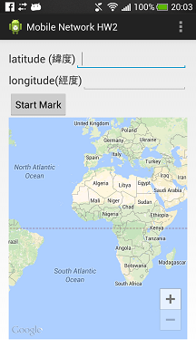

Mobile Network Homework 2
=========================

- Develop by Eclipse.
- Android version: 4.2 (API Level 17).
- Also compatible with 4.1. But I didn't test other versions.

Requirements
------------

- Google Play Services SDK.
- Replace your Google Maps API key in ``res/values/strings.xml``.

Functions
---------

- Display a map with Google Maps Android API v2.
- Set a marker of giving latitude and longitude.
- Move the map to the marker you set.

Known Bugs
----------

- If latitude or longitude is not a number, the APP will crash.

